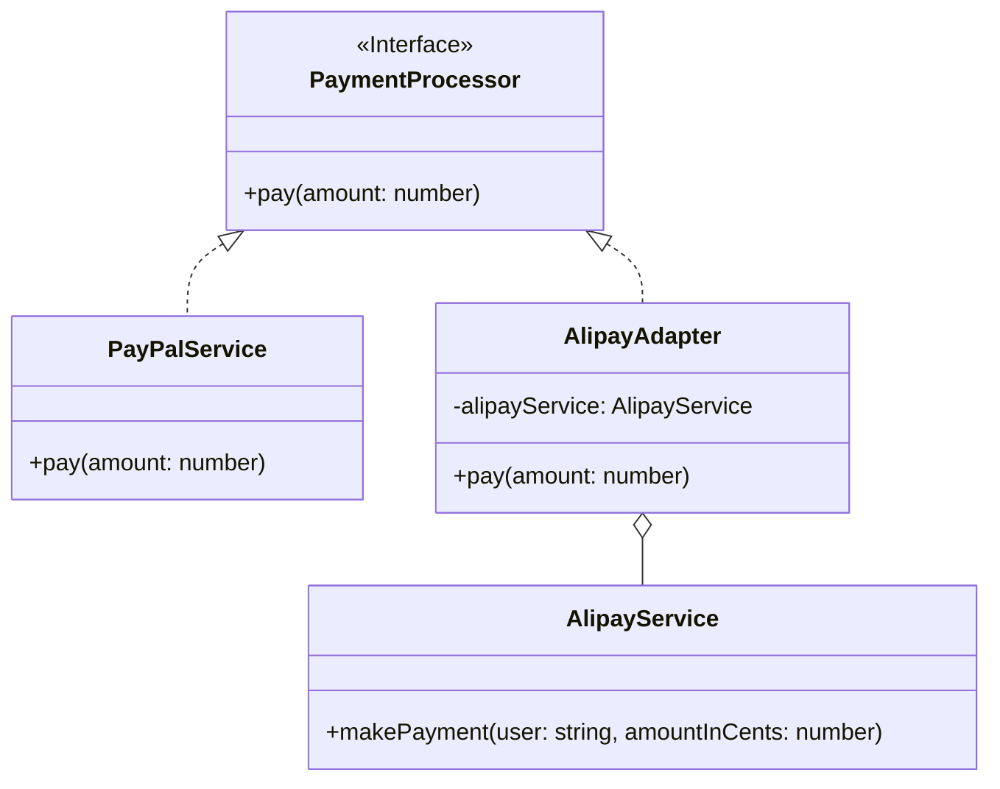

# 适配器模式 (Adapter Pattern)

## 意图

**适配器模式**是一种结构型设计模式，它能使接口不兼容的对象能够相互合作。

适配器模式扮演着两个对象之间的中间人角色，它将一个对象的接口转换成客户端预期的另一个接口。这使得原本由于接口不兼容而不能一起工作的类可以协同工作。

## 结构



## 场景：万能插头

想象一下，你的应用程序中有一个支付模块，它依赖一个定义好的 `PaymentProcessor` 接口来处理所有支付。目前，你系统中的 `PayPalService` 完美地实现了这个接口。

现在，公司决定要接入一个新的支付渠道：支付宝 (`Alipay`)。问题是，支付宝提供的 SDK（我们称之为 `AlipayService`）有着完全不同的接口。例如，它的支付方法叫 `makePayment`，并且需要的参数也和我们的 `pay` 方法不同。

😱 **问题**：
插头插不进去！你总不能把酒店墙拆了换插座（修改第三方代码），也不能把电脑插头剪了重新接线（修改现有稳定代码）。

💡 **适配器模式**：
你买了一个**转换插头（Adapter）**。
*   转换插头的一端是**国标三孔插座**，刚好能插你的电脑。
*   另一端是**欧标两孔插头**，刚好能插进墙里。

在我们的支付系统中：
*   **电脑** = 你的业务代码（只认识 `PaymentProcessor.pay()`）。
*   **墙壁插座** = 支付宝 SDK（只提供 `AlipayService.makePayment()`）。
*   **转换插头** = `AlipayAdapter`。

你的业务代码只管调用 `pay()`，适配器在中间偷偷地把它“翻译”成支付宝能听懂的 `makePayment()`。

## 代码解析

1.  **目标 (Target)**: (`PaymentProcessor` 接口)
    *   这是我们系统通用的支付接口，所有代码都依赖它。
    ```typescript
    // src/adapter-pattern/target/payment-processor.ts
    export interface PaymentProcessor {
      pay(amount: number): void;
    }
    ```

2.  **被适配者 (Adaptee)**: (`AlipayService` 类)
    *   这是第三方提供的支付宝 SDK，它的接口跟我们不一样（方法名不同，参数单位也不同）。我们改不了它的代码。
    ```typescript
    // src/adapter-pattern/adaptee/alipay-service.ts
    export class AlipayService {
      public makePayment(user: string, amountInCents: number): void {
        console.log(`User ${user} is paying ${amountInCents / 100} CNY via Alipay.`);
      }
    }
    ```

3.  **适配器 (Adapter)**: (`AlipayAdapter` 类)
    *   这就是那个“转换插头”。它实现了我们的 `PaymentProcessor` 接口，所以系统觉得它就是个普通支付方式。
    *   但实际上，它内部藏了一个 `AlipayService`。当系统调用 `pay` 时，它就转手调用 `AlipayService.makePayment`。
    ```typescript
    // src/adapter-pattern/adapter/alipay-adapter.ts
    export class AlipayAdapter implements PaymentProcessor {
      private readonly alipayService: AlipayService;

      constructor(alipayService: AlipayService) {
        this.alipayService = alipayService;
      }

      public pay(amount: number): void {
        const currentUser = 'user_123';
        const amountInCents = amount * 100; // 转换参数单位
        // 转发调用
        this.alipayService.makePayment(currentUser, amountInCents);
      }
    }
    ```

4.  **客户端 (Client)**: (`processPayment` 函数)
    *   它只知道 `PaymentProcessor`，完全不知道背后是 PayPal 还是支付宝。
    ```typescript
    // src/adapter-pattern/index.ts
    function processPayment(processor: PaymentProcessor, amount: number) {
      console.log('Client: Processing a payment...');
      processor.pay(amount);
    }

    // 使用旧的 PayPal
    const payPalService = new PayPalService();
    processPayment(payPalService, 150);

    // 使用新的支付宝（通过适配器）
    const alipayAdapter = new AlipayAdapter(new AlipayService());
    processPayment(alipayAdapter, 200);
    ```

## 优点

*   **单一职责原则**: 你可以将接口转换的逻辑从主要的业务逻辑中分离出来。
*   **开闭原则**: 你可以在不修改现有客户端代码的情况下，将新的适配器引入程序中，从而支持新的第三方服务。
*   **代码复用**: 可以复用那些接口不兼容的现有类。

## 如何运行示例

你可以通过以下命令来运行这个 TypeScript 示例：

```bash
npx ts-node src/adapter-pattern/index.ts
```