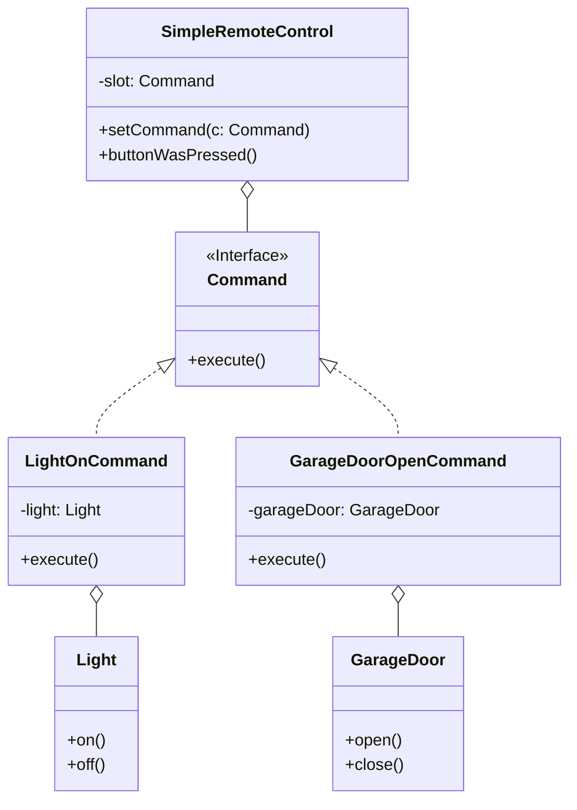

# 命令模式 (Command Pattern)

## 意图

**命令模式**是一种行为设计模式，它能将一个请求封装为一个独立的对象，从而让你能够用不同的请求、队列或日志来参数化客户端，并支持可撤销的操作。

简而言之，命令模式将请求的发起者（调用者）和请求的执行者（接收者）完全解耦。

## 结构



## 场景：万能遥控器

想象一下，你买了一个**万能遥控器**，上面只有一个按钮。
你想用它控制家里的所有电器：灯、车库门、音响、甚至电风扇。

1.  **普通做法**：
    你在遥控器代码里写死：`if (device == light) light.on(); else if (device == garage) garage.open();`
    这太蠢了！每买一个新家电，你都得拆开遥控器改电路板（修改代码）。

2.  **命令模式做法**：
    *   **遥控器（Invoker）**：它很傻，它只知道“按下按钮就执行 `slot.execute()`”。它根本不知道那个 `slot` 里装的是什么，也不关心。
    *   **命令对象（Command）**：这是一个中间层。比如 `LightOnCommand`，它把“灯”和“开灯这个动作”打包在一起。
    *   **你（Client）**：你负责把“开灯命令”装进遥控器的卡槽里。

当你按下按钮时：
遥控器喊：“执行！” -> 命令对象收到指令 -> 命令对象转身去按灯的开关 -> 灯亮了。

这样，遥控器和具体的家电就完全解耦了。你可以随时把“开灯卡片”拔出来，换插一张“开车库门卡片”，遥控器代码一行都不用改！

## 代码解析

1.  **命令 (Command)**: (`Command` 接口)
    *   所有命令卡片的通用接口。只有一个简单的 `execute` 方法。
    ```typescript
    // src/command-pattern/command/command.ts
    export interface Command {
        execute(): void;
    }
    ```

2.  **接收者 (Receiver)**: (`Light`, `GarageDoor` 类)
    *   真正干活的家电。它们知道怎么开灯、怎么开门。
    ```typescript
    // src/command-pattern/receiver/light.ts
    export class Light {
        public on(): void { console.log("Light is On"); }
        public off(): void { console.log("Light is Off"); }
    }
    ```

3.  **具体命令 (Concrete Command)**: (`LightOnCommand` 等)
    *   这就是那张“功能卡片”。它把一个家电（`Light`）和一个动作（`on`）绑定在一起。
    ```typescript
    // src/command-pattern/command/light-on-command.ts
    export class LightOnCommand implements Command {
        private light: Light;

        constructor(light: Light) { this.light = light; }

        public execute(): void {
            this.light.on(); // 委托给接收者去执行
        }
    }
    ```

4.  **调用者 (Invoker)**: (`SimpleRemoteControl` 类)
    *   这就是遥控器。它只持有一个 `Command` 接口。
    ```typescript
    // src/command-pattern/invoker/simple-remote-control.ts
    export class SimpleRemoteControl {
        private slot: Command;

        public setCommand(command: Command): void { this.slot = command; }

        public buttonWasPressed(): void {
            this.slot.execute(); // 我不管是谁，反正我执行了
        }
    }
    ```

5.  **客户端 (Client)**: (`index.ts`)
    *   负责组装。把家电、命令、遥控器连起来。
    ```typescript
    // src/command-pattern/index.ts
    const remote = new SimpleRemoteControl(); // 1. 拿遥控器
    const light = new Light("Living Room");   // 2. 买个灯
    const lightOn = new LightOnCommand(light);// 3. 制作“开灯”卡片

    remote.setCommand(lightOn); // 4. 把卡片插进遥控器
    remote.buttonWasPressed();  // 5. 按按钮 -> 灯亮了！
    ```

## 优点

*   **解耦**: 将请求的调用者和执行者解耦，这是命令模式最主要的优点。
*   **开闭原则**: 你可以轻松地在不修改现有客户端或调用者代码的情况下，引入新的命令。
*   **可组合性**: 你可以组装一系列命令来实现一个宏命令（Macro Command）。
*   **支持撤销/重做**: 命令对象可以添加 `undo()` 方法，从而轻松实现撤销和重做功能。

## 如何运行示例

你可以通过以下命令来运行这个 TypeScript 示例：

```bash
npx ts-node src/command-pattern/index.ts
```