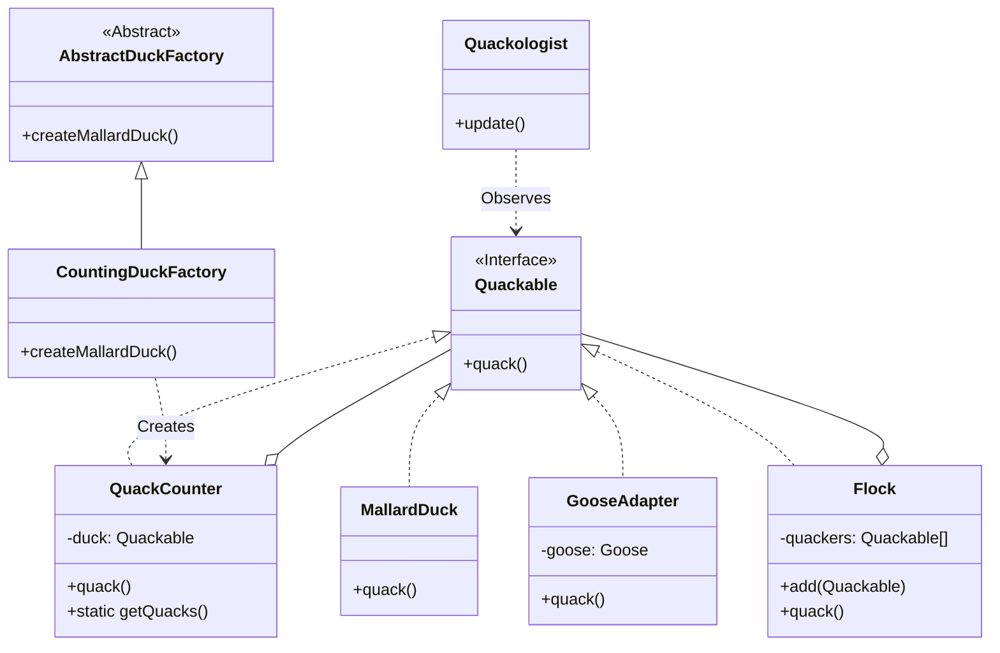

# 复合模式 (Compound Pattern)

## 意图

**复合模式**并不是一个独立的设计模式，而是指在一个解决方案中组合使用多个设计模式。当多个模式协同工作，解决一个通用或复杂的问题时，就形成了一个复合模式。

我们的“鸭子模拟器”是一个经典的复合模式示例，它将多个我们之前学习过的模式融合在了一起，以创建一个灵活、可维护且功能丰富的系统。

## 结构



## 场景：鸭子复仇者联盟

我们不只是在造一只鸭子，我们是在打造**鸭子界的复仇者联盟**。这个系统复杂到需要动用 5 种设计模式才能搞定：

1.  **适配器模式 (Adapter) - 雷神的锤子**：
    *   我们有一只**鹅 (Goose)**，它只会 `honk()`。
    *   但我们的系统只认 `quack()`。
    *   所以我们给鹅装了个**翻译器 (GooseAdapter)**，让它也能混进鸭子堆里 `quack()`。

2.  **装饰器模式 (Decorator) - 钢铁侠的战衣**：
    *   我们想统计鸭子叫了多少次。
    *   我们不修改鸭子本身，而是给每只鸭子穿上一件**智能战衣 (QuackCounter)**。
    *   这件战衣会记录叫声，然后再让鸭子叫。

3.  **组合模式 (Composite) - 联盟集结**：
    *   我们不仅要管理单只鸭子，还要管理**一群鸭子 (Flock)**。
    *   我们希望对“一群鸭子”下令“叫！”，这群鸭子里的每一只都会叫。
    *   `Flock` 让我们能像操作一只鸭子一样操作一整群鸭子。

4.  **工厂模式 (Factory) - 尼克·弗瑞**：
    *   为了确保每只新加入的鸭子都穿上了“智能战衣”（被装饰），我们不能直接 `new Duck()`。
    *   我们建立了一个**兵工厂 (CountingDuckFactory)**。所有鸭子都必须从这里生产，出厂自带计数器。

5.  **观察者模式 (Observer) - 神盾局监控**：
    *   **呱呱叫学家 (Quackologist)** 想实时监控鸭子的行为。
    *   每当鸭子叫的时候，都会自动向学家发送信号。

## 代码解析

这个复合模式将上述所有模式融合在一起：

*   **核心接口**: `Quackable`。所有的鸭子、适配器、装饰器、组合体都实现了这个接口。
*   **适配器**: `GooseAdapter` 实现了 `Quackable`，内部持有 `Goose`。
*   **装饰器**: `QuackCounter` 实现了 `Quackable`，内部持有 `Quackable`（被装饰者）。
*   **组合**: `Flock` 实现了 `Quackable`，内部持有 `Quackable[]`（子节点列表）。
*   **工厂**: `CountingDuckFactory` 负责创建被 `QuackCounter` 包装过的鸭子。

```typescript
// src/compound-pattern/index.ts 的模拟过程：

// 1. 创建工厂
const duckFactory = new CountingDuckFactory();

// 2. 创建各种鸭子（自动带计数器）
const mallard = duckFactory.createMallardDuck();
const goose = new GooseAdapter(new Goose()); // 适配鹅

// 3. 创建组合（群）
const flock = new Flock();
flock.add(mallard);
flock.add(goose);

// 4. 添加观察者
const quackologist = new Quackologist();
flock.registerObserver(quackologist);

// 5. 执行！
flock.quack(); 
// 输出：
// Quackologist: MallardDuck just quacked.
// Quack
// Quackologist: GooseAdapter just quacked.
// Honk
// Total quacks: 2
```

## 如何运行示例

你可以通过以下命令来运行这个 TypeScript 示例：

```bash
npx ts-node src/compound-pattern/index.ts
```