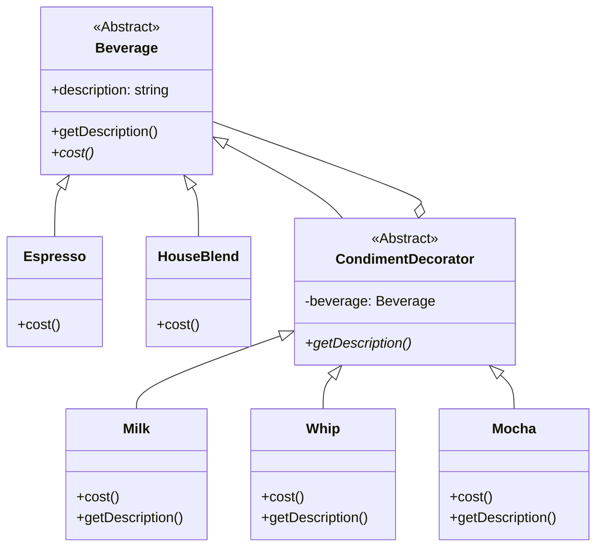

# 装饰器模式 (Decorator Pattern)

## 意图

**装饰器模式**是一种结构型设计模式，它允许你通过将对象放入包含行为的特殊“包装器”中，来为原对象动态地添加新的行为或职责，而无需修改其代码。

这个模式通常被用来在运行时扩展一个对象的功能，是继承的一种灵活替代方案。

## 结构



## 场景：套娃咖啡

想象一下你在玩**俄罗斯套娃**，但是每个娃娃代表一种配料。

1.  **核心娃娃**是咖啡本身（比如 `Espresso`）。
2.  你想加牛奶？那就拿一个**牛奶娃娃（Milk Decorator）**，把核心娃娃装进去。现在从外面看，它是一个“加了牛奶的Espresso”。
3.  还想加摩卡？再拿一个**摩卡娃娃（Mocha Decorator）**，把刚才那个“牛奶Espresso”再装进去。
4.  最后结账时，你问最外面的大娃娃：“你多少钱？”
    *   摩卡娃娃说：“我的摩卡钱是 0.2，但我肚子里还有货，我得问问它。”
    *   牛奶娃娃说：“我的牛奶钱是 0.1，但我肚子里还有货，我得问问它。”
    *   Espresso 核心说：“我值 1.99。”
    *   最后结果层层返回：1.99 + 0.1 + 0.2 = 2.29。

这就是装饰器模式！你不需要创建 `EspressoWithMilkAndMocha` 这种死板的类，而是像**穿衣服**或者**套娃**一样，一层层地把功能加上去。

## 代码解析

1.  **组件 (Component)**: (`Beverage` 抽象类)
    *   这是所有饮料和调料的共同祖先。
    ```typescript
    // src/decorator-pattern/Component/Beverage.ts
    export abstract class Beverage {
        protected description: string = 'Unknown Beverage';
        public getDescription(): string { return this.description; }
        public abstract cost(): number;
    }
    ```

2.  **具体组件 (Concrete Component)**: (`Espresso` 类)
    *   这是最里面的“核心娃娃”，也就是基础饮料。
    ```typescript
    // src/decorator-pattern/Component/Espresso.ts
    export class Espresso extends Beverage {
        constructor() { super(); this.description = "Espresso"; }
        public cost(): number { return 1.99; }
    }
    ```

3.  **装饰器 (Decorator)**: (`CondimentDecorator` 抽象类)
    *   这是所有“套娃”的基类。关键点在于：**它既是饮料（继承 Beverage），又包含饮料（持有 Beverage）**。
    ```typescript
    // src/decorator-pattern/Decorator/CondimentDecorator.ts
    export abstract class CondimentDecorator extends Beverage {
        protected beverage: Beverage; // 我肚子里包着另一个饮料
        public abstract getDescription(): string;
    }
    ```

4.  **具体装饰器 (Concrete Decorator)**: (`Milk`, `Whip` 等)
    *   具体的调料。它在计算价格或描述时，会先加上自己的份，然后再问问肚子里的饮料。
    ```typescript
    // src/decorator-pattern/Decorator/Milk.ts
    export class Milk extends CondimentDecorator {
        constructor(beverage: Beverage) {
            super();
            this.beverage = beverage;
        }

        public getDescription(): string {
            return this.beverage.getDescription() + ', Milk'; // 递归调用
        }

        public cost(): number {
            return .10 + this.beverage.cost(); // 递归调用
        }
    }
    ```

5.  **客户端 (Client)**: (`index.ts`)
    *   像搭积木一样组装咖啡。
    ```typescript
    // src/decorator-pattern/index.ts
    // Start with a plain Espresso
    let espresso: Beverage = new Espresso();

    // Wrap it with Milk
    espresso = new Milk(espresso);

    // Wrap it with Whip
    espresso = new Whip(espresso);

    // Get the final description and cost
    console.log(espresso.getDescription() + ' $' + espresso.cost());
    // Outputs: Espresso, Milk, Whip $2.29
    ```

## 优点

*   **开闭原则**: 你可以在不修改现有对象代码的情况下，为其添加新的功能。
*   **灵活性**: 相比于使用继承来扩展功能，装饰器模式更加灵活。你可以在运行时动态地添加或移除装饰。
*   **避免类爆炸**: 可以通过组合不同的装饰器来获得多种功能组合，避免了创建大量功能各异的子类。
*   **单一职责原则**: 你可以将一个庞大的、拥有多种功能选项的类，拆分成多个功能单一的装饰器。

## 如何运行示例

你可以通过以下命令来运行这个 TypeScript 示例：

```bash
npx ts-node src/decorator-pattern/index.ts
```