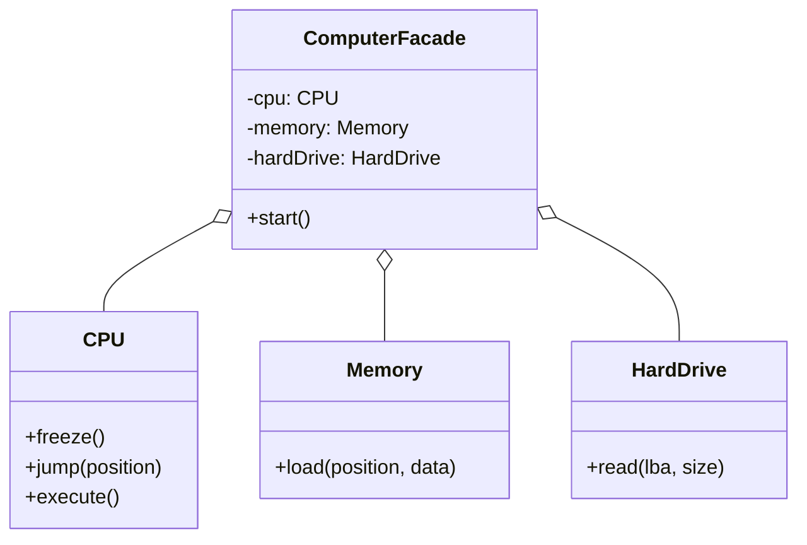

# 外观模式 (Facade Pattern)

## 意图

**外观模式**是一种结构型设计模式，它为一组复杂的子系统（如一个库或框架）提供一个简化的、统一的接口。

外观模式定义了一个更高层次的接口，使得子系统更容易使用。它将客户端的请求代理给相应的子系统对象，从而隐藏了系统的复杂性。

## 结构



## 场景：一键启动

想象一下，你是一个电脑小白，你想玩电脑。
但是，如果启动电脑需要你手动操作每一个硬件：
1.  先给 CPU 发个信号：“嘿，冻结一下！”
2.  然后去硬盘那里：“把引导扇区的数据读出来。”
3.  再跑到内存那里：“把刚才读的数据写到这个地址去。”
4.  最后再跑回 CPU：“好了，跳到那个地址开始执行吧！”

😱 **崩溃了**：
这太复杂了！你只是想玩个扫雷而已，为什么要懂这么多底层指令？而且万一你顺序搞错了，电脑可能直接冒烟。

💡 **外观模式**：
电脑厂商给你提供了一个**开机按钮（Facade）**。
你只需要按一下这个按钮（调用 `computer.start()`），剩下的脏活累活（CPU、内存、硬盘的交互）全都在机箱内部自动完成了。

在我们的代码中：
*   **你** = 客户端代码。
*   **机箱内部复杂的硬件** = 子系统 (`CPU`, `Memory`, `HardDrive`)。
*   **开机按钮** = `ComputerFacade`。

外观模式就是给复杂的子系统穿上一层简单、漂亮的外衣，让你用起来更爽。

## 代码解析

1.  **子系统 (Subsystem)**: (`CPU`, `Memory`, `HardDrive` 类)
    *   这些是干实事的底层工兵。它们功能强大但接口复杂，而且彼此之间可能还有依赖。它们根本不知道“外观”的存在。
    ```typescript
    // src/facade-pattern/subsystem/cpu.ts
    export class CPU {
      public freeze(): void { /* ... */ }
      public jump(position: number): void { /* ... */ }
      public execute(): void { /* ... */ }
    }
    // ... 内存和硬盘同理
    ```

2.  **外观 (Facade)**: (`ComputerFacade` 类)
    *   这就是那个“开机按钮”。它知道如何指挥底下的工兵们协同工作。
    *   它把复杂的流程封装在一个简单的 `start()` 方法里。
    ```typescript
    // src/facade-pattern/facade/computer-facade.ts
    export class ComputerFacade {
      protected cpu: CPU;
      protected memory: Memory;
      protected hardDrive: HardDrive;

      constructor() {
        this.cpu = new CPU();
        this.memory = new Memory();
        this.hardDrive = new HardDrive();
      }

      public start(): void {
        console.log("Computer starting...");
        this.cpu.freeze(); // 1. 冻结 CPU
        const bootData = this.hardDrive.read(/* ... */); // 2. 读硬盘
        this.memory.load(/* ... */, bootData); // 3. 写内存
        this.cpu.jump(/* ... */); // 4. CPU 跳转
        this.cpu.execute(); // 5. 执行
        console.log("Computer started successfully!");
      }
    }
    ```

3.  **客户端 (Client)**: (`clientCode` 函数)
    *   客户端现在爽了，只需要一行代码就能启动电脑。
    ```typescript
    // src/facade-pattern/index.ts
    function clientCode() {
      // 客户端只需要与外观类交互。
      const computer = new ComputerFacade();
      computer.start(); // 一键启动！
    }
    ```

## 优点

*   **简化接口**: 为复杂的系统提供了一个简单的接口，使得客户端更容易使用。
*   **解耦**: 将客户端代码与底层子系统解耦。子系统的修改不会影响到客户端，只要外观的接口保持不变。
*   **分层**: 帮助构建分层系统。你可以使用外观来定义每层的入口点。

## 如何运行示例

你可以通过以下命令来运行这个 TypeScript 示例：

```bash
npx ts-node src/facade-pattern/index.ts
```