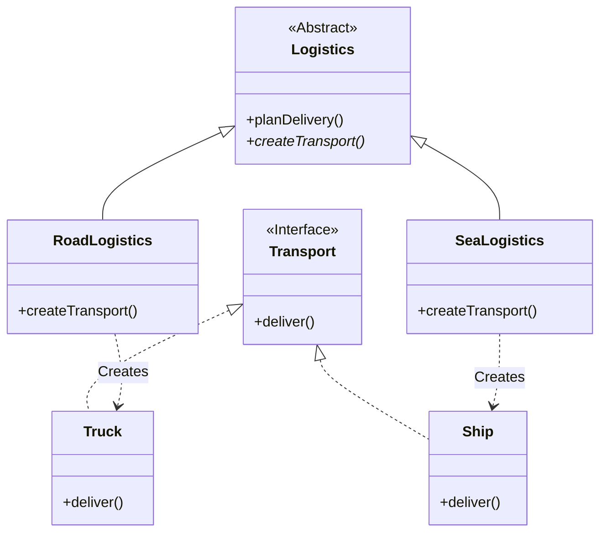

# 工厂方法模式 (Factory Method Pattern)

## 意图

**工厂方法模式**是一种创建型设计模式，它提供一个用于创建对象的接口，但让子类决定实例化哪一个类。工厂方法让一个类的实例化延迟到其子类。

换句话说，它定义了一个创建对象的“工厂”方法，但把具体创建什么对象的决定权交给了子类。

## 结构



## 场景：物流大亨

想象一下，你经营着一家**物流公司**。
起初，你只有几辆**卡车**，所以你的代码里到处都是 `new Truck()`。生意很红火。

后来，业务扩展到了海外，你需要**轮船**。
😱 **问题**：
代码里几百个地方写死了 `new Truck()`。如果要加轮船，你得把代码翻个底朝天，加上无数的 `if (type == 'sea')` 判断。这简直是维护噩梦。

💡 **工厂方法模式**：
你决定改变管理方式。你不再亲自去买车买船，而是制定了一个**标准流程（Logistics）**。
*   **总公司（Logistics）**：只规定“我们要运输（planDelivery）”，但具体用什么运，我不管。
*   **公路分部（RoadLogistics）**：负责买**卡车（Truck）**。
*   **海运分部（SeaLogistics）**：负责买**轮船（Ship）**。

当客户下单时，你只需要根据订单类型，把任务交给“公路分部”或者“海运分部”。
分部会自己去搞定交通工具（调用 `createTransport`），你完全不用操心细节。
如果以后要加“空运分部”，你只需要新开一个分部，完全不用动老代码！

## 代码解析

1.  **产品 (Product)**: (`Transport` 接口)
    *   这是所有交通工具的共同标准：必须能“送货”。
    ```typescript
    // src/factory-method-pattern/transport/transport.ts
    export interface Transport {
      deliver(): void;
    }
    ```

2.  **具体产品 (Concrete Product)**: (`Truck`, `Ship` 类)
    *   真正的干活工具。卡车在陆地上跑，轮船在水里游。
    ```typescript
    // src/factory-method-pattern/transport/truck.ts
    export class Truck implements Transport {
      public deliver(): void {
        console.log('Delivering by land in a box.');
      }
    }
    ```

3.  **创建者 (Creator)**: (`Logistics` 抽象类)
    *   这是总公司。它定义了业务逻辑（`planDelivery`），但把“创建工具”这个关键步骤留成了一个抽象方法（`createTransport`）。
    ```typescript
    // src/factory-method-pattern/creator/logistics.ts
    export abstract class Logistics {
      // 工厂方法：核心点！我不知道具体是个啥，子类你去定。
      public abstract createTransport(): Transport;

      public planDelivery(): void {
        // 我只管用，不管造。
        const transport = this.createTransport();
        transport.deliver();
      }
    }
    ```

4.  **具体创建者 (Concrete Creator)**: (`RoadLogistics`, `SeaLogistics` 类)
    *   这是分部。它们实现了工厂方法，真正制造出具体的对象。
    ```typescript
    // src/factory-method-pattern/creator/road-logistics.ts
    export class RoadLogistics extends Logistics {
      // 我是公路部，我当然造卡车。
      public createTransport(): Transport {
        return new Truck();
      }
    }
    ```

## 优点

*   **开闭原则**: 你可以在不修改现有客户端代码的情况下引入新的产品类型。
*   **单一职责原则**: 你可以将产品创建代码放在程序的单一位置，从而使得代码更容易维护。
*   **松耦合**: 创建者和具体产品之间的耦合度降低了。创建者只关心产品接口，不关心具体实现。

## 如何运行示例

你可以通过以下命令来运行这个 TypeScript 示例：

```bash
npx ts-node src/factory-method-pattern/index.ts
```