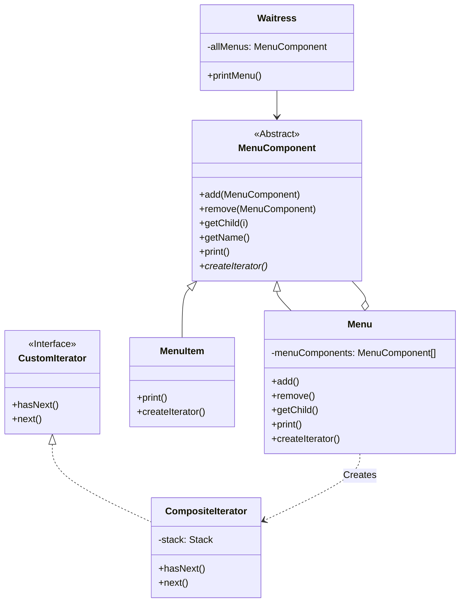

# 组合模式 (Composite) 与 迭代器模式 (Iterator)

这两个模式经常被一起使用来处理树状数据结构。

## 结构



## 场景：俄罗斯套娃菜单

### 组合模式 (Composite)
想象一下你在管理一个超级复杂的餐厅菜单。
*   **菜单 (Menu)** 就像一个**文件夹**。
*   **菜单项 (MenuItem)** 就像一个**文件**。

但是，文件夹里不仅可以有文件，还可以有**子文件夹**（比如“甜点菜单”）。子文件夹里还可以有子子文件夹。
这就是一个**树状结构**。

如果你想打印整个菜单：
1.  **普通做法**：你需要写一堆循环，先遍历主菜单，遇到子菜单又要写个循环遍历子菜单……如果有 10 层嵌套，你就得写 10 层循环？太可怕了。
2.  **组合模式做法**：
    你把“菜单”和“菜单项”看作是一样的东西（都继承自 `MenuComponent`）。
    *   你对菜单项说：“打印自己。” -> 它打印出菜名。
    *   你对菜单说：“打印自己。” -> 它打印出标题，然后**自动**对它里面的所有东西（无论是菜还是子菜单）说：“打印自己。”
    这样，无论嵌套多少层，你只需要调用一次 `allMenus.print()`，整个树结构就自动打印出来了！

### 迭代器模式 (Iterator)
现在，服务员（`Waitress`）需要遍历菜单上的每一道菜来检查过敏原。
*   早餐菜单用 `ArrayList` 存菜。
*   午餐菜单用 `Array` 存菜。
*   晚餐菜单用 `Map` 存菜。

服务员疯了：“我难道要学会操作 Java 的 List、Array 和 Map 才能报菜名吗？”

💡 **迭代器模式**：
所有的菜单都必须提供一个**统一的遥控器（Iterator）**。
服务员不需要知道菜单内部是怎么存的，她只需要拿起遥控器，按“下一个 (next)”按钮。
*   不管你是数组、列表还是哈希表，只要你能给我一个迭代器，我就能遍历你。

## 代码解析

### 组合模式部分

1.  **组件 (Component)**: (`MenuComponent` 抽象类)
    *   这是“文件夹”和“文件”的共同祖先。它定义了所有操作（加、减、打印、创建迭代器）。
    ```typescript
    // src/iterator-and-composite-pattern/component/menu-component.ts
    export abstract class MenuComponent {
        // 默认实现抛出异常，这样叶子节点就不需要实现 add/remove 了
        public add(menuComponent: MenuComponent): void { throw new Error("Unsupported Operation"); }
        public remove(menuComponent: MenuComponent): void { throw new Error("Unsupported Operation"); }
        public getChild(i: number): MenuComponent { throw new Error("Unsupported Operation"); }
        
        public getName(): string { throw new Error("Unsupported Operation"); }
        public getDescription(): string { throw new Error("Unsupported Operation"); }
        public getPrice(): number { throw new Error("Unsupported Operation"); }
        public isVegetarian(): boolean { throw new Error("Unsupported Operation"); }

        public abstract print(): void;
        public abstract createIterator(): CustomIterator<MenuComponent>;
    }
    ```

2.  **组合 (Composite)**: (`Menu` 类)
    *   这是“文件夹”。它里面有一个列表 `menuComponents` 用来存子节点。
    *   它的 `print()` 方法会递归调用子节点的 `print()`。
    ```typescript
    // src/iterator-and-composite-pattern/component/menu.ts
    export class Menu extends MenuComponent {
        private menuComponents: MenuComponent[] = [];
        // ...

        public add(menuComponent: MenuComponent): void {
            this.menuComponents.push(menuComponent);
        }

        public print(): void {
            console.log(`\n${this.getName()}, ${this.getDescription()}`);
            console.log("---------------------");
            // 递归打印所有子节点
            for (const menuComponent of this.menuComponents) {
                menuComponent.print();
            }
        }
        
        public createIterator(): CustomIterator<MenuComponent> {
            return new CompositeIterator(this.menuComponents);
        }
    }
    ```

3.  **叶子 (Leaf)**: (`MenuItem` 类)
    *   这是“文件”。它是树的末端。
    ```typescript
    // src/iterator-and-composite-pattern/component/menu-item.ts
    export class MenuItem extends MenuComponent {
        // ...
        public print(): void {
            console.log(`  ${this.getName()}`);
        }
        
        public createIterator(): CustomIterator<MenuComponent> {
            return new NullIterator(); // 叶子节点没有子节点，返回空迭代器
        }
    }
    ```

4.  **客户端 (Client)**: (`Waitress` 类)
    *   通过组件接口来操纵组合中的对象，无需关心它是叶子还是组合。
    ```typescript
    // src/iterator-and-composite-pattern/waitress.ts
    export class Waitress {
        private allMenus: MenuComponent;

        constructor(allMenus: MenuComponent) {
            this.allMenus = allMenus;
        }

        public printMenu(): void {
            this.allMenus.print(); // 一行代码打印整个树！
        }
    }
    ```

### 迭代器模式部分

1.  **迭代器 (Iterator)**: (`CustomIterator` 接口)
    *   定义了遍历元素所需的操作接口（如 `next`, `hasNext`）。
    ```typescript
    // src/iterator-and-composite-pattern/iterator/iterator.ts
    export interface CustomIterator<T> {
        hasNext(): boolean;
        next(): T;
    }
    ```

2.  **具体迭代器 (Concrete Iterator)**: (`CompositeIterator` 类)
    *   这是一个复杂的迭代器，它能遍历整个树结构（通常使用栈来实现深度优先遍历）。
    ```typescript
    // src/iterator-and-composite-pattern/iterator/composite-iterator.ts
    export class CompositeIterator implements CustomIterator<MenuComponent> {
        private stack: Stack<CustomIterator<MenuComponent>> = new Stack();
        
        // ... 负责遍历树状结构的逻辑
    }
    ```

## 如何运行示例

你可以通过以下命令来运行这个 TypeScript 示例：

```bash
npx ts-node src/iterator-and-composite-pattern/index.ts
```