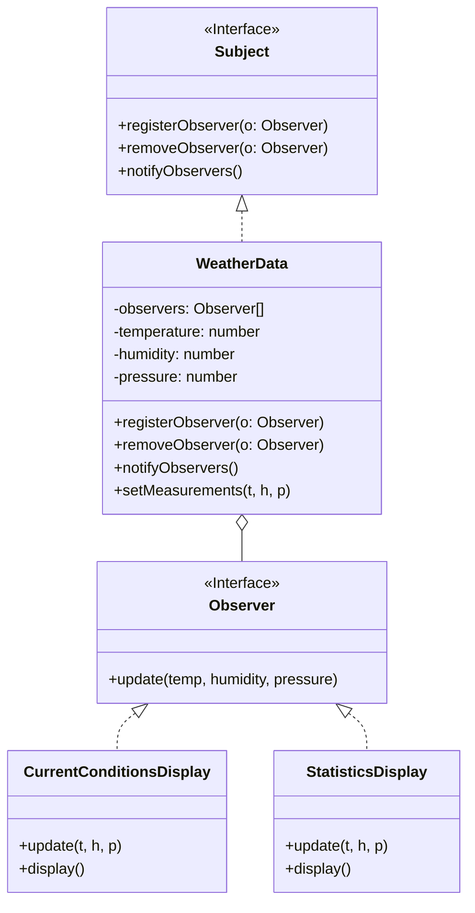

# 观察者模式 (Observer Pattern)

## 意图

**观察者模式**是一种行为设计模式，它允许你定义一种订阅机制，当一个对象（“主题”）的状态发生改变时，能够自动通知所有依赖于它的对象（“观察者”）。

换句话说，它在对象之间建立一种一对多的依赖关系，当一方改变状态时，所有依赖者都会收到通知并自动更新。

## 结构



## 场景：报纸订阅

想象一下**报社（Subject）**和**订阅者（Observer）**的关系。

1.  **报社**每天印刷报纸。
2.  **你（订阅者）**向报社订阅了报纸。
3.  每当有新报纸印出来，报社就会自动把它**送（Notify）**到你家门口。
4.  如果你不想看了，随时可以**取消订阅**，报社就不再送了。
5.  报社不管你是谁，是张三还是李四，也不管你是拿报纸来垫桌角还是认真阅读，它只管把报纸送到每一个订阅者手里。

在我们的气象站例子中：
*   **报社** = `WeatherData`（它持有最新的天气数据）。
*   **订阅者** = 各种布告板（`CurrentConditionsDisplay`, `StatisticsDisplay`）。
*   **送报纸** = 调用 `update()` 方法，把数据传过去。

这样，无论以后增加多少种新的布告板（比如“穿衣指数布告板”、“农业气象布告板”），`WeatherData` 的代码都不用改，只需要让新布告板去“订阅”一下就行了。

## 代码解析

1.  **主题 (Subject)**: (`Subject` 接口)
    *   这是“报社”的规矩：允许人订阅、取消订阅、以及发通知。
    ```typescript
    // src/observer-pattern/subject/Subject.ts
    export interface Subject {
        registerObserver(o: Observer): void;
        removeObserver(o: Observer): void;
        notifyObservers(): void;
    }
    ```

2.  **观察者 (Observer)**: (`Observer` 接口)
    *   这是“订阅者”的规矩：必须有一个“收报纸”的信箱（`update` 方法）。
    ```typescript
    // src/observer-pattern/observer/Observer.ts
    export interface Observer {
        update(temp: number, humidity: number, pressure: number): void;
    }
    ```

3.  **具体主题 (Concrete Subject)**: (`WeatherData` 类)
    *   真正的气象数据中心。它有一个小本本（`observers` 数组），记着谁订阅了数据。
    *   数据一更新，它就遍历小本本，挨个打电话通知。
    ```typescript
    // src/observer-pattern/subject/WeatherData.ts
    export class WeatherData implements Subject {
        private observers: Observer[] = [];
        // ...

        public registerObserver(o: Observer): void {
            this.observers.push(o);
        }

        public notifyObservers(): void {
            for (const observer of this.observers) {
                observer.update(this.temperature, this.humidity, this.pressure);
            }
        }
        
        public setMeasurements(temperature: number, humidity: number, pressure: number): void {
            this.temperature = temperature;
            // ... set other properties
            this.notifyObservers(); // Notify observers when state changes
        }
    }
    ```

4.  **具体观察者 (Concrete Observer)**: (`CurrentConditionsDisplay` 等)
    *   具体的布告板。它在构造函数里就迫不及待地去注册订阅了。
    *   一旦 `update` 被调用，它就拿到最新数据，然后展示出来。
    ```typescript
    // src/observer-pattern/observer/CurrentConditionsDisplay.ts
    export class CurrentConditionsDisplay implements Observer {
        // ...
        constructor(weatherData: Subject) {
            this.weatherData = weatherData;
            weatherData.registerObserver(this); // 嘿，我要订阅！
        }

        public update(temperature: number, humidity: number, pressure: number): void {
            this.temperature = temperature;
            this.humidity = humidity;
            this.display(); // 数据来了，刷新显示！
        }
        
        public display(): void {
            console.log(`Current conditions: ${this.temperature}F degrees and ${this.humidity}% humidity`);
        }
    }
    ```

## 优点

*   **开闭原则**: 你可以在不修改现有主题或观察者代码的情况下，引入新的观察者。
*   **松耦合**: 主题只知道它有一系列的观察者，每个观察者都实现了 `Observer` 接口。它不知道观察者的具体类别，这大大降低了主题和观察者之间的耦合度。
*   **广播通信**: 主题可以向任意数量的观察者广播通知，而无需关心接收者是谁。

## 如何运行示例

你可以通过以下命令来运行这个 TypeScript 示例：

```bash
npx ts-node src/observer-pattern/index.ts
```