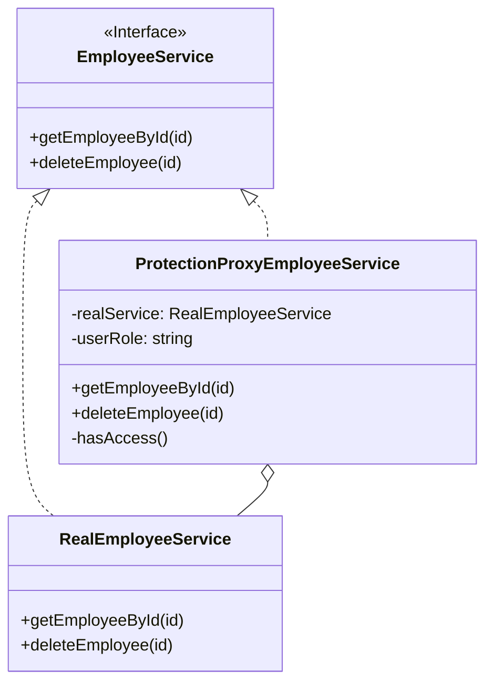

# 代理模式 (Proxy Pattern)

## 意图

**代理模式**是一种结构型设计模式，它为你提供了一个对象的替代品或占位符，以控制对这个对象的访问。

代理控制着对原对象的访问，并允许在将请求传递给原对象之前或之后执行某些操作。

## 结构



## 场景：夜店保镖

想象一下，`RealEmployeeService` 是一家**顶级夜店（VIP 区域）**。
这里面存着公司的核心机密（员工数据），比如谁的工资多少，谁要被开除。

1.  **普通做法**：
    大门敞开，谁都能进。结果清洁工阿姨不小心按了个按钮，把 CEO 给删了。这太危险了！

2.  **代理模式**：
    我们在门口放了一个**保镖（Proxy）**。
    *   你想进去？先过保镖这一关。
    *   保镖会问：“你是谁？给我看你的 ID（User Role）。”
    *   如果你是**管理员（Admin）**，保镖放行：“请进，老板。”（转发请求给真实服务）。
    *   如果你是**普通员工（User）**，保镖拦住：“对不起，你没权限进 VIP 房。”（拒绝请求，抛出异常）。

对于外面的客户来说，保镖看起来和夜店经理一样（实现了相同的接口），你跟保镖说话，就像跟经理说话一样。但保镖多了一层**安全检查**。

## 代码解析

1.  **主题 (Subject)**: (`EmployeeService` 接口)
    *   这是夜店的“规矩”。不管是真经理还是保镖，都得遵守这个接口。
    ```typescript
    // src/proxy-pattern/subject/employee-service.ts
    export interface EmployeeService {
        getEmployeeById(id: string): Employee | undefined;
        deleteEmployee(id: string): void;
    }
    ```

2.  **真实主题 (Real Subject)**: (`RealEmployeeService` 类)
    *   这是真正的夜店经理。他手里有钥匙，能真正执行删除操作。
    ```typescript
    // src/proxy-pattern/real-subject/real-employee-service.ts
    export class RealEmployeeService implements EmployeeService {
        public deleteEmployee(id: string): void {
            console.log(`[RealService] Deleting employee with id ${id}`);
            this.employees.delete(id);
        }
        // ...
    }
    ```

3.  **代理 (Proxy)**: (`ProtectionProxyEmployeeService` 类)
    *   这就是保镖。他手里拿着真经理的电话（引用）。
    *   当有人要删人时，他先检查 `hasAccess()`。
    ```typescript
    // src/proxy-pattern/proxy/protection-proxy-employee-service.ts
    export class ProtectionProxyEmployeeService implements EmployeeService {
        private realService: RealEmployeeService;
        private userRole: 'ADMIN' | 'USER';

        constructor(realService: RealEmployeeService, userRole: 'ADMIN' | 'USER') {
            this.realService = realService;
            this.userRole = userRole;
        }

        private hasAccess(): boolean {
            return this.userRole === 'ADMIN'; // 只有管理员能进
        }

        public deleteEmployee(id: string): void {
            console.log(`[Proxy] User '${this.userRole}' is attempting to delete employee.`);
            if (this.hasAccess()) {
                console.log("[Proxy] Access granted.");
                this.realService.deleteEmployee(id); // 权限通过，放行！
            } else {
                throw new Error("Access Denied!"); // 拦住！
            }
        }
    }
    ```

## 优点

*   **控制访问**: 你可以在不修改真实服务代码的情况下，管理对它的访问（例如，进行权限检查、懒加载、日志记录等）。
*   **开闭原则**: 你可以在不修改客户端或真实主题代码的情况下，引入新的代理来增加新的功能。
*   **单一职责原则**: 将访问控制等辅助性功能从核心业务逻辑中分离出来。

## 如何运行示例

你可以通过以下命令来运行这个 TypeScript 示例：

```bash
npx ts-node src/proxy-pattern/index.ts
```