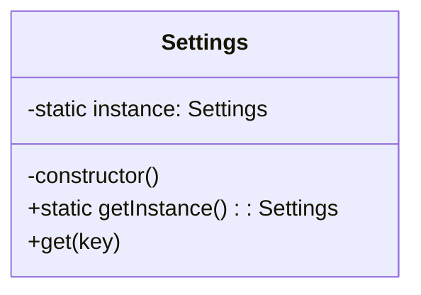

# 单例模式 (Singleton Pattern)

## 意图

**单例模式**是一种创建型设计模式，它保证一个类仅有一个实例，并提供一个访问该实例的全局节点。

当你需要一个对象来协调整个系统的操作时，单例模式非常有用。例如，一个全局的配置管理器、一个日志记录器或者一个数据库连接池。

## 结构



## 场景：一国之君

想象一下，一个国家能有两个国王吗？
如果两个国王同时下命令，一个说“向东走”，一个说“向西走”，军队就疯了。

在软件系统中，有些东西也必须是**独一无二**的，比如：
*   **配置中心 (Settings)**：全局只有一份配置，不能这里是 A，那里是 B。
*   **数据库连接池**：大家共用一个池子，不能每个人都自己挖一个池子。

💡 **单例模式**：
单例模式就像是**君主制**。
1.  **私有构造函数**：就像皇宫大门紧闭，普通人（其他类）不能随便生个王子（`new Settings()`）出来当国王。
2.  **静态方法 (`getInstance`)**：这是唯一的觐见通道。
    *   如果国王还没出生，就生一个（创建实例）。
    *   如果国王已经在了，就直接把你带到现任国王面前（返回现有实例）。

不管你在系统的哪个角落，只要你呼唤“国王（`getInstance`）”，出现的永远是同一个人。

## 代码解析

单例模式的实现通常包含以下几个关键点：

1.  **私有静态实例 (Private Static Instance)**:
    *   皇位。用来坐（保存）唯一的国王。

2.  **私有构造函数 (Private Constructor)**:
    *   **关键点！** 把 `constructor` 设为 `private`，彻底断绝了外部 `new Settings()` 的念头。

3.  **公有静态访问方法 (Public Static Access Method)**:
    *   觐见通道。通常叫 `getInstance()`。

```typescript
// src/singleton-pattern/settings.ts
export class Settings {
    // 1. 皇位：持有类唯一实例
    private static instance: Settings;

    // 2. 禁宫：私有化构造函数，防止外部篡位
    private constructor() {
        console.log("Settings instance created. Initializing settings...");
    }

    // 3. 觐见通道：全局访问点
    public static getInstance(): Settings {
        if (!Settings.instance) {
            // 如果还没国王，就立一个
            Settings.instance = new Settings();
        }
        // 返回现任国王
        return Settings.instance;
    }

    // ... 国王的日常工作
    public get(key: string): string | undefined { /* ... */ }
}
```

## 优点

*   **保证单一实例**: 确保一个类只有一个实例，避免了多个实例可能导致的状态冲突。
*   **全局访问点**: 提供了一个方便的全局访问点，可以轻松地从代码的任何地方访问该实例。
*   **延迟初始化 (Lazy Initialization)**: 只有在第一次请求实例时，才会创建它。这在实例创建开销较大时可以节省资源。

## 如何运行示例

你可以通过以下命令来运行这个 TypeScript 示例：

```bash
npx ts-node src/singleton-pattern/index.ts
```