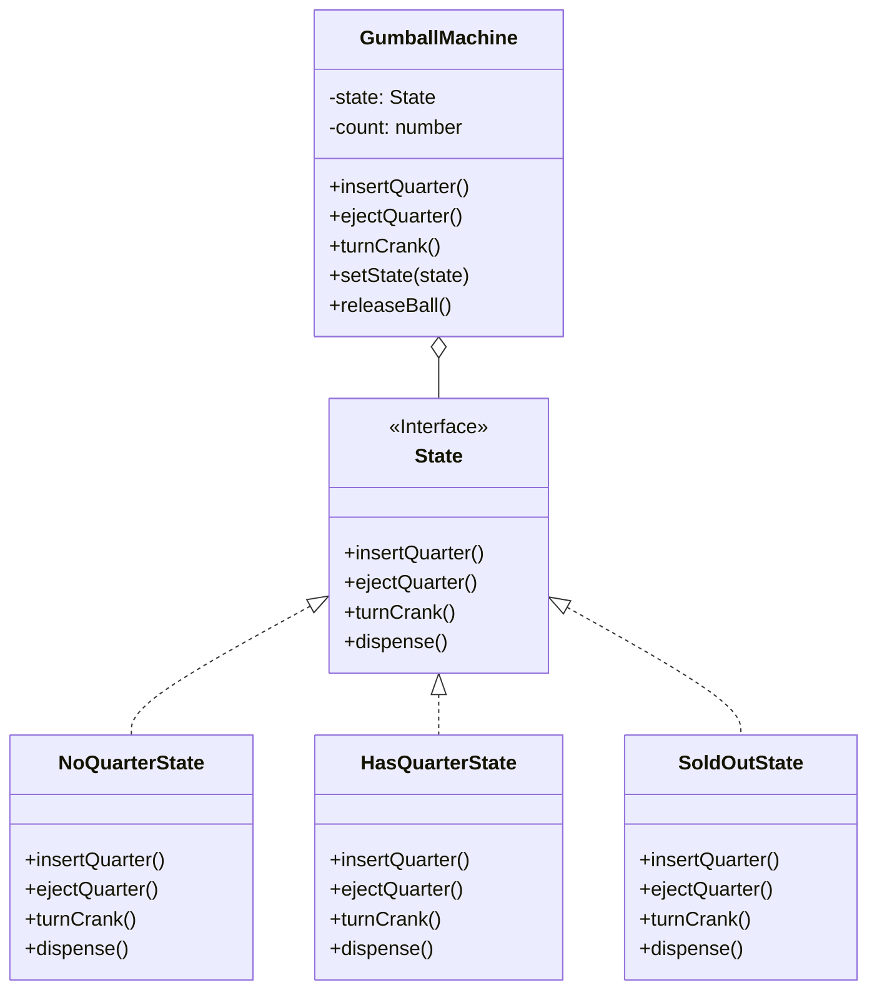

# 状态模式 (State Pattern)

## 意图

**状态模式**是一种行为设计模式，它允许一个对象在其内部状态改变时改变其行为。该对象看起来就像是改变了它的类。

这个模式的核心思想是，将与特定状态相关的行为局部化，并将不同状态的行为分散到不同的状态对象中。

## 结构



## 场景：善变的糖果机

想象一下，你正在设计一台**自动糖果机**。
这台机器就像一个**情绪化的人**，它的行为完全取决于它当前的“心情”（状态）：

1.  **没钱状态 (NoQuarterState)**：
    *   它很渴望钱。如果你投币，它会很高兴地变成“有钱状态”。
    *   如果你转曲柄，它会嘲笑你：“没钱转什么转？”

2.  **有钱状态 (HasQuarterState)**：
    *   它很满足。如果你退币，它会把钱吐给你，变回“没钱状态”。
    *   如果你转曲柄，它会给你糖果，然后看看还有没有库存。

3.  **售罄状态 (SoldOutState)**：
    *   它很绝望。无论你做什么（投币、转曲柄），它都只会告诉你：“没货了，别烦我。”

**糟糕的实现**：
如果你在 `GumballMachine` 类里写一堆 `if (state === HAS_QUARTER) ... else if (state === SOLD_OUT) ...`，你的代码就会变成一团乱麻。每加一个新状态（比如“赢家状态”，有几率送两颗糖），你就要把所有 `if/else` 改一遍。

**状态模式的实现**：
我们把每个状态都变成一个**独立的类**（`NoQuarterState`, `HasQuarterState` 等）。
糖果机（Context）不再自己做决定，而是把动作**委托**给当前的状态对象。
*   糖果机：“有人转曲柄了！”
*   当前状态（比如没钱状态）：“告诉他没门。”
*   当前状态（比如有钱状态）：“给他糖果，然后把他切到‘售罄’或‘没钱’状态。”

## 代码解析

1.  **上下文 (Context)**: (`GumballMachine` 类)
    *   它是对外的主体。它持有一个 `currentState`。
    *   它的方法（`insertQuarter`, `turnCrank`）其实都是空壳，它们直接调用 `this.currentState.insertQuarter()`。
    ```typescript
    // src/state-pattern/context/gumball-machine.ts
    export class GumballMachine {
        private currentState: State;

        public insertQuarter(): void {
            this.currentState.insertQuarter(); // 委托给状态对象
        }

        // 允许状态对象改变机器的状态
        public setState(state: State): void {
            this.currentState = state;
        }
    }
    ```

2.  **状态 (State)**: (`State` 接口)
    *   定义了所有状态都必须响应的动作（投币、退币、转动曲柄、发放糖果）。
    ```typescript
    // src/state-pattern/state/state.ts
    export interface State {
        insertQuarter(): void;
        ejectQuarter(): void;
        turnCrank(): void;
        dispense(): void;
    }
    ```

3.  **具体状态 (Concrete State)**: (`NoQuarterState` 等类)
    *   每个类代表一种特定的“心情”。
    *   它们知道在当前心情下该怎么做，并且知道该何时切换到下一种心情。
    ```typescript
    // src/state-pattern/state/no-quarter-state.ts
    export class NoQuarterState implements State {
        // ...
        public insertQuarter(): void {
            console.log("You inserted a quarter");
            // 状态流转：没钱 -> 有钱
            this.gumballMachine.setState(this.gumballMachine.getHasQuarterState());
        }
    }
    ```

## 优点

*   **单一职责原则**: 将与特定状态相关的代码组织到独立的类中。
*   **开闭原则**: 你可以在不修改现有状态类或上下文代码的情况下，引入新的状态。
*   **简化代码**: 避免了在上下文中出现庞大、复杂的条件语句。

## 如何运行示例

你可以通过以下命令来运行这个 TypeScript 示例：

```bash
npx ts-node src/state-pattern/index.ts
```