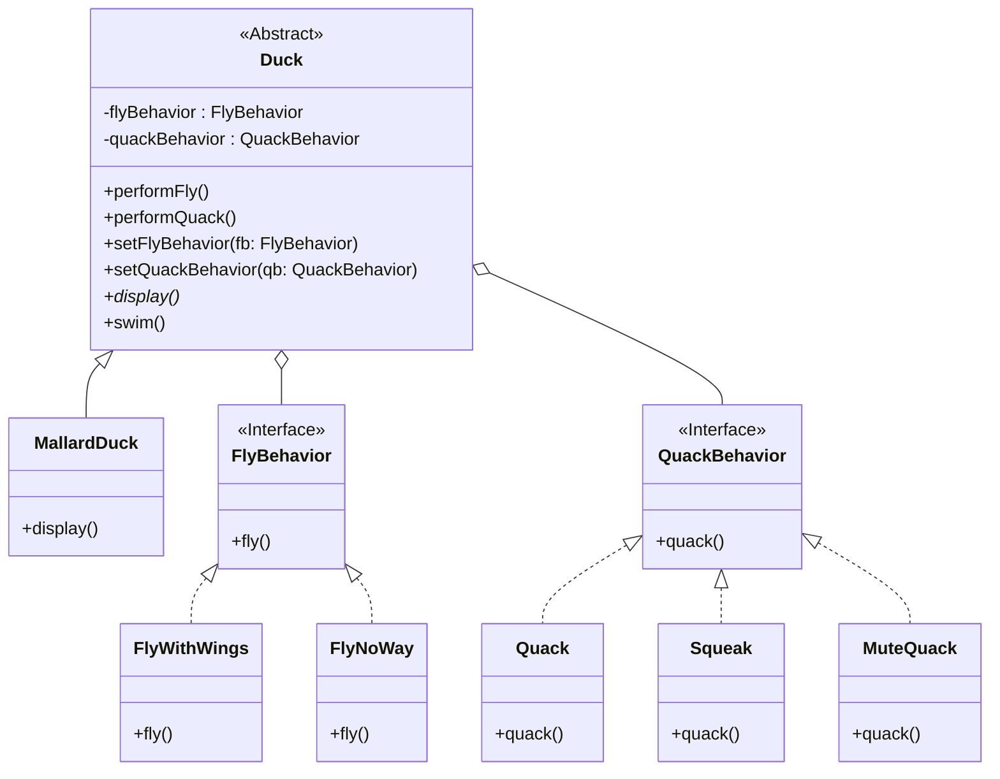

# 策略模式 (Strategy Pattern)

## 意图

**策略模式**是一种行为设计模式，它定义了一系列算法，将每一个算法封装起来，并使它们可以相互替换。策略模式让算法的变化独立于使用算法的客户端。

简而言之，它允许你在运行时，根据不同的情况，选择一个对象应该如何执行某个特定的行为。

## 结构



## 场景：鸭子模拟器

想象一下，你正在开发一款**超级鸭子模拟器**游戏。

一开始，你用继承的方式，让所有鸭子都继承自一个 `Duck` 父类，并在父类里写了 `fly()` 和 `quack()` 方法。
一切看起来都很美好，直到有一天，产品经理要求加一种**橡皮鸭 (Rubber Duck)**。

😱 **问题出现了**：
橡皮鸭继承了 `Duck` 类，结果它竟然会在天上飞（因为它继承了 `fly`）！这简直是灾难。

🤔 **尝试解决**：
你可能会想：“那我覆盖橡皮鸭的 `fly` 方法，让它什么都不做不就好了？”
但是，如果以后又要加**诱饵鸭 (Decoy Duck)**（既不会飞也不会叫），或者**火箭鸭**（飞得超快），你难道要每一个都去覆盖、去修改吗？如果飞行逻辑变了，你得去每一个子类里改代码，这简直是维护噩梦！

💡 **策略模式来拯救**：
策略模式告诉你：**把变化的部分拿出来，独立封装。**

在这个例子中，**飞行**和**叫声**是会变化的。
1.  我们把“飞行”抽象成一个接口 `FlyBehavior`。
2.  想要怎么飞？造具体的类：`FlyWithWings`（用翅膀飞）、`FlyNoWay`（不会飞）、`FlyRocketPowered`（火箭飞）。
3.  鸭子类 `Duck` 不再亲自实现飞行，而是**持有**一个 `FlyBehavior` 对象。
4.  想飞的时候，鸭子就喊一声：“嘿，那个谁（FlyBehavior），帮我飞一下！”

这样一来，鸭子就像是**装备了不同的技能卡片**。
*   绿头鸭装备了 `FlyWithWings` 卡片。
*   橡皮鸭装备了 `FlyNoWay` 卡片。
*   最酷的是，你甚至可以在游戏运行时，按一个按钮，瞬间把一只不会飞的鸭子变成火箭鸭（通过 `setFlyBehavior` 换一张卡片）！

这就是策略模式的魅力：**组合优于继承**，让算法（行为）可以独立于使用它的客户（鸭子）而变化。

## 代码解析

1.  **策略接口 (Strategy Interface)**: (`FlyBehavior`, `QuackBehavior`)
    *   定义了所有支持的算法的公共接口。
    ```typescript
    // src/strategy-pattern/FlyBehavior/FlyBehavior.ts
    export interface FlyBehavior {
        fly(): void;
    }
    ```

2.  **具体策略 (Concrete Strategy)**: (`FlyWithWings` 等)
    *   实现了策略接口，封装了具体的算法。
    ```typescript
    // src/strategy-pattern/FlyBehavior/FlyWithWings.ts
    export class FlyWithWings implements FlyBehavior {
        public fly(): void {
            console.log("I'm flying!");
        }
    }
    ```

3.  **上下文 (Context)**: (`Duck` 抽象类)
    *   持有一个对策略对象的引用。
    *   它不直接执行行为，而是将工作委托给链接的策略对象。
    *   它提供 `set` 方法，允许客户端在运行时“换装备”（替换策略）。
    ```typescript
    // src/strategy-pattern/Duck.ts
    export abstract class Duck {
        protected quackBehavior: QuackBehavior;
        protected flyBehavior: FlyBehavior;

        constructor(quackBehavior: QuackBehavior, flyBehavior: FlyBehavior) {
            this.quackBehavior = quackBehavior;
            this.flyBehavior = flyBehavior;
        }

        // 将飞行行为委托给策略对象
        public performFly(): void {
            this.flyBehavior.fly();
        }

        // 在运行时改变飞行行为
        public setFlyBehavior(fb: FlyBehavior): void {
            this.flyBehavior = fb;
        }
        // ... quack behavior 同理
    }
    ```

## 优点

*   **灵活切换**: 可以在运行时动态改变对象的行为（就像换装备一样）。
*   **易于扩展**: 增加新的行为（比如“喷气式飞行”），只需要加一个新的策略类，完全不需要修改现有的鸭子类，符合**开闭原则**。
*   **避免多重条件判断**: 消除了代码中大量的 `if...else` 或 `switch` 语句。
*   **复用性强**: 不同的鸭子可以共用同一个飞行策略类。

## 如何运行示例

你可以通过以下命令来运行这个 TypeScript 示例：

```bash
npx ts-node src/strategy-pattern/index.ts
```