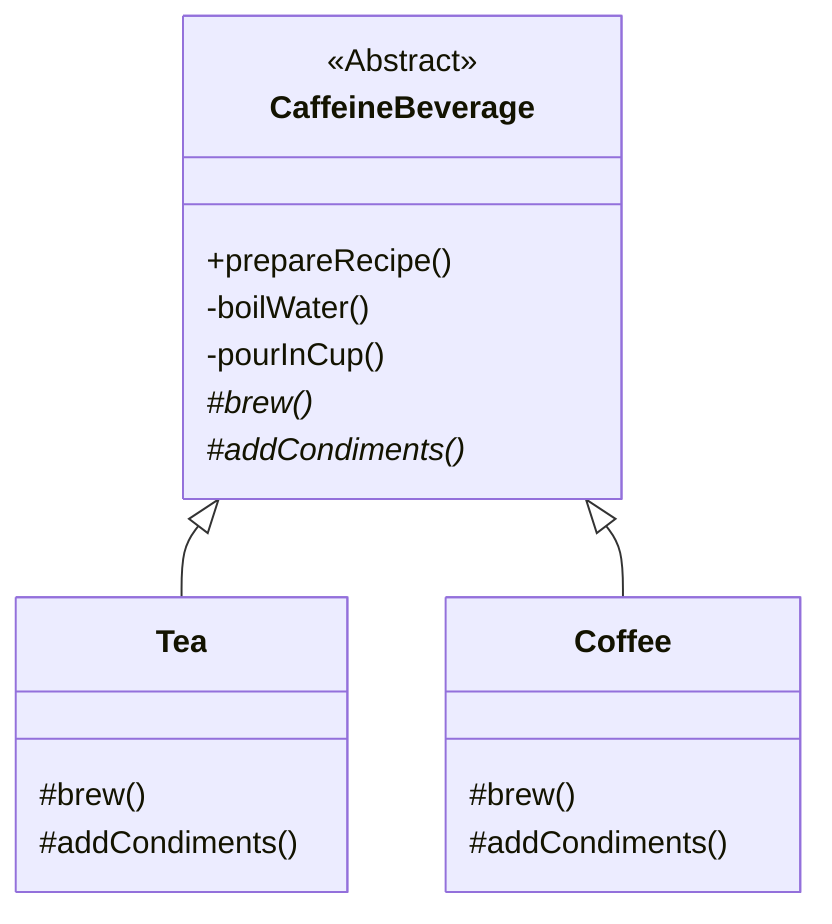

# 模板方法模式 (Template Method Pattern)

## 意图

**模板方法模式**是一种行为设计模式，它在一个方法中定义一个算法的骨架，而将一些步骤的实现延迟到子类中。模板方法使得子类可以在不改变算法结构的情况下，重新定义算法的某些特定步骤。

## 结构



## 场景：星巴克实习生

想象一下，你刚去星巴克当实习生。店长给你一张**SOP（标准作业程序）**，上面写着制作热饮的 4 个步骤：

1.  把水烧开（所有饮料都一样）。
2.  **用沸水冲泡原料**（这一步看你是做茶还是做咖啡）。
3.  把饮料倒进杯子（所有饮料都一样）。
4.  **加调料**（茶加柠檬，咖啡加糖奶）。

💡 **模板方法模式**：
这张 SOP 就是一个**模板（Template）**。
*   它规定了流程的**骨架**（先烧水，再冲泡，再倒杯，最后加料）。
*   它把**不变的步骤**（烧水、倒杯）直接写死了。
*   它把**变化的步骤**（冲泡、加料）留空，让你根据具体情况去填空。

在代码中：
*   `CaffeineBeverage` 类就是那张 SOP。`prepareRecipe()` 方法就是那个雷打不动的流程。
*   `Tea` 和 `Coffee` 类就是具体的执行者，它们只需要负责填好“冲泡”和“加料”这两个空就行了，不用操心整个流程怎么跑。

## 代码解析

1.  **抽象类 (Abstract Class)**: (`CaffeineBeverage` 类)
    *   这是模板的核心。它拥有一个 `prepareRecipe` 方法，像导演一样控制着整个流程。
    *   它还定义了一些抽象方法（`brew`, `addCondiments`），强制子类必须去实现。
    ```typescript
    // src/template-method-pattern/caffeine-beverage.ts
    export abstract class CaffeineBeverage {
        // 模板方法：定义了算法的骨架，且通常是 final 的（不让子类覆盖）
        public prepareRecipe(): void {
            this.boilWater();
            this.brew(); // 关键点：调用抽象方法，推迟到子类实现
            this.pourInCup();
            this.addCondiments(); // 关键点：调用抽象方法
        }

        // 具体方法：所有子类通用的逻辑
        private boilWater(): void { console.log("Boiling water"); }
        private pourInCup(): void { console.log("Pouring into cup"); }

        // 抽象方法：留给子类去填的空
        protected abstract brew(): void;
        protected abstract addCondiments(): void;
    }
    ```

2.  **具体类 (Concrete Class)**: (`Tea`, `Coffee` 类)
    *   它们只需要关注自己独特的逻辑。
    ```typescript
    // src/template-method-pattern/tea.ts
    export class Tea extends CaffeineBeverage {
        // 茶叶怎么泡？
        protected brew(): void {
            console.log("Steeping the tea");
        }
        // 茶加什么料？
        protected addCondiments(): void {
            console.log("Adding Lemon");
        }
    }
    ```

## 优点

*   **代码复用**: 将算法中不变的部分提取到父类中，避免了代码重复。
*   **开闭原则**: 你可以在不修改现有算法结构的情况下，引入新的子类来实现算法中的可变部分。
*   **控制反转 (Inversion of Control)**: 父类调用子类的操作，而不是相反。这是一种被称为“好莱坞原则”（“不要来找我们，我们会来找你”）的体现。

## 如何运行示例

你可以通过以下命令来运行这个 TypeScript 示例：

```bash
npx ts-node src/template-method-pattern/index.ts
```